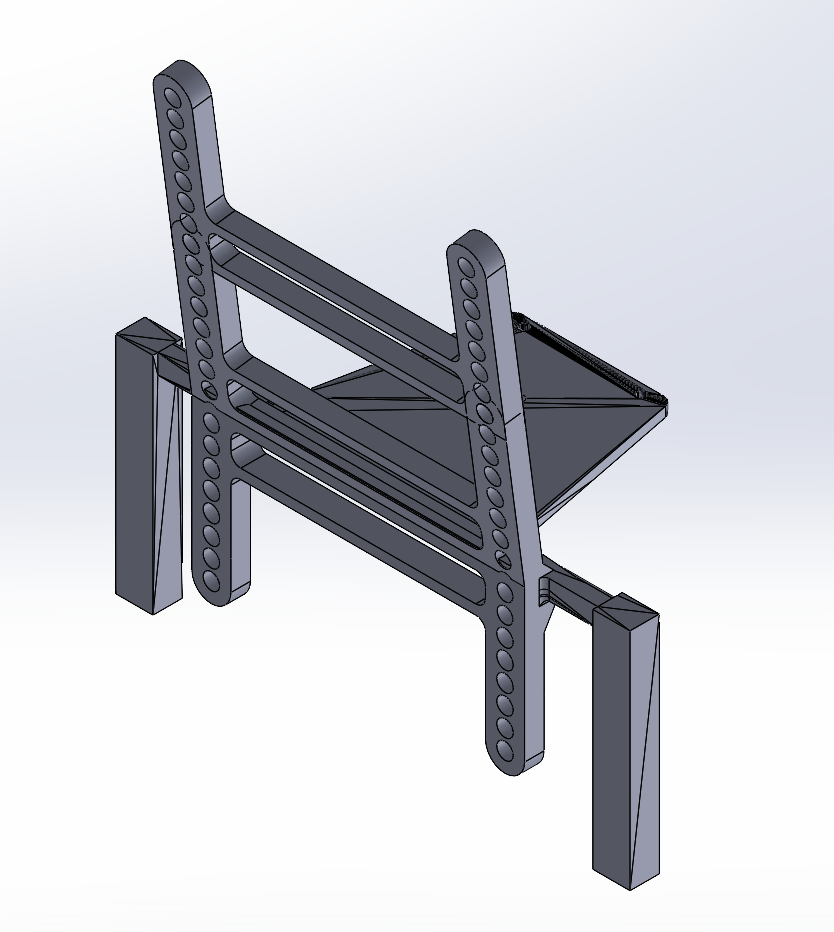

# Final Report for Team 3 (ECE/MAE 148)

## Team Members
* Nathaniel Barnaby - ECE
* Yang-Jie Qin - ECE
* Cheuk Hin Bryan Cheng - MAE
* Patrick Nguyen - MAE

## Project Overview
* Our initial final project was a combination of the usage of an IMU and GNSS to implement position tracking. An IMU is an inertial measurement unit, composing of gyros, accelerometers, and more sensors to track the movement of something. With these sensors, the car's location can be estimated off of a general initial GPS location with the addition to its movement measured by its speed, acceleration, turning, etc. This ended up being too complex for our team which resulted in little progress. We were then assigned new mini tasks which consists of using 2 of the sensors provided in our kits. The assignment was to use the OAK-D camera and the lidar separately to measure depth of both a small (0.15m) object and a larger (0.5m) object at different distances. We ended up comparing results of both objects at distances of 0.5, 1, 2, 3, and 4 meters. We would then compare the outputed values from the sensors to what the actual correspond measurment. A comparison between the accuracy of depth finding between the Oak-D camera and lidar would also be necesasry. A second task was assigned which was to output a face recognition system out of the OAK-D camera. 

## Results
* For the distance measurement assignment, both the camera and lidar were able to successfully measure distance for the small the large object at the different ranges. 
* For the camera, it was accurate at determining smaller distances, but at larger distances (3+ meters) error seemed to begin growing exponentionally. The difference between small and large objects was negligible as long as the area in which the distances were averaged fit within the object, which at further distances can start causing fluctuations with smaller objects. 
* For the lidar, it was accurate at determining all distances with a linear or almost static amount of error. At smaller distances this was larger than the error of the camera, but at larger distances it vastly outperformed the camera due to the nature of the camera's exponential error. Additionally, the lidar had to be hand-calibrated, so with more time the error could have been lowered due to this effect. Also, since we recorded distance measurements within a range of 0.4 degrees, the measurement would be inaccurate with a smaller object at longer distances. This could be overcame by decreasing the range and waiting longer.
* For most scenarios the lidar seems to be the winning choice for distance measurement. While at lower distances the camera seemed to outperform the lidar, the lidar seems to be more consistent with its measurements than the camera. Additionally, the lidar offers 360 degrees of distance measurements while the camera only works in one direction.

* DepthAI Distance Measurement with ~0.5 m^2 Object Video Link: https://youtube.com/shorts/I1zaVxE-bjM?feature=share
* DepthAI Distance Measurement with 0.15 m^2 Box Video Link: https://youtube.com/shorts/GPADi4bS-fw?feature=share

* LiDAR Distance Measurement with ~0.5 m^2 Object Video Link: https://youtu.be/Ee81_VBHxKI
* LiDAR Distance Measurement with 0.15 m^2 Box Video Link: https://youtu.be/ARffTMx1PJ0

* As for the camera face recognition, we were succesfully able to output video display which recognizes faces. This is a relatively fast responding system. It outputs the number of faces it recognizes which we tested from 0-3 faces real time. There is some error within the system as it can be innacurate thinking other shiny objects and or parts of a face are another face. It is also not limited to stationary faces as it recognizes people moving too. 
* Face Recognition Video Link: https://youtu.be/nUz8OR_zHPA

## Gantt Chart

## Hardware: Mechanical Design

\
Camera/flashlight Mount

\
Electronics Tray

\
Front/rear Electronics Plate Offset

\
GPS Mount

\
IMU Mount

\
Jetson Case Key Mount

\
Jetson Nano Main Case

\
Lidar Tower

\
Servo Voltage Converter

\
Vesc Power Distributor

## Previous Designs

## Electronic Components
\
Jetson Nano

\
OAK-D Camera

\
Lidar LD06

## Electronic Wiring Schematic

## Final Set Up

Bird's Eye View

Left View

Right View

### Packages and Drivers
* cv2 (OpenCV)
* depthai (DepthAI)
* numpy
* math
* binascii

## Milestones
* Face Recognition using DepthAI - Detects faces through a webcam and displays a count in the terminal
* Distance Measurement using DepthAI - Using the disparity between the left and right cameras of the OAKD, distance can be calculated. This was averaged over an area to give an estimated distance of an object.
* Distance Measurement using LiDAR - Using a LiDAR is is relatively simple to detect distances in a 360 degree range. By averaging distances over a very small range (0.4 degrees) we determined the distance of an object.

## Potential Future Work/Unaccomplished Goals
* Recognizing and labeling specific faces
* Running code off of the OAK-D Camera instead of needing an external computer to run the code.

## Presentations
Final Project Proposal: https://docs.google.com/presentation/d/1vLvXRnHzHm6p_IpEQy8KJgz--vOFd6M9xa7Q-qHD2Ls/edit?usp=sharing
Final Presentation: https://docs.google.com/presentation/d/17J6LZ2QZ177BDr7g3x7ZcxHlyUQ-m4LtXGy9BRernRI/edit?usp=sharing

## Acknowledgments
Professor Jack Silberman, TA Kishore Nukala, Moises Lopez-Mendoza, Design and Innovation Building, all of our wonderful classmates
